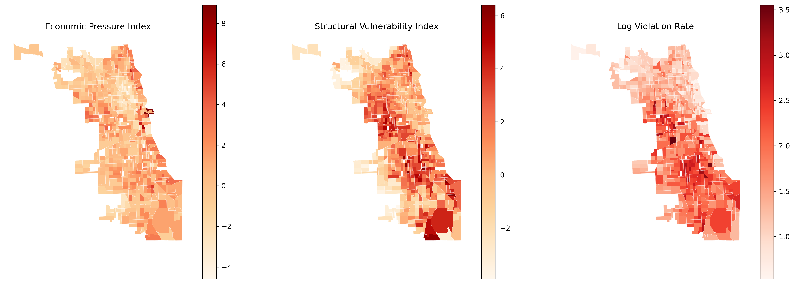
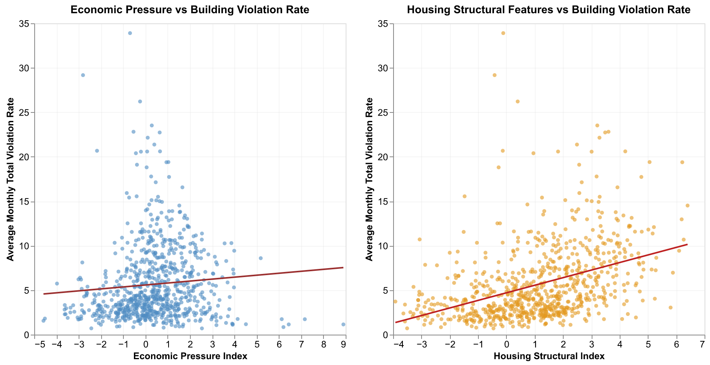

## Group Information
**Group Number:**
46  
**Course:**
Section4 -- PPHA 30538  
**Group Members:**
Susan Zhang (GitHub: SusanYaranZhang, Section 4); Weiyi Wang (GitHub: weiyiwang-611, Section 4); Yuqian Sui (GitHub: yqsui, Section 4)

## Research Question
How are housing violations distributed across neighborhoods in Chicago, and to what extent can economic pressure and housing structural vulnerability explain these spatial patterns?

## Data and Approach
### Data Resources
The building violations data come from the City of Chicago Data Portal (`building_violations_raw`), including violation dates, codes/descriptions, and locations. 
\
Census tract–level measures come from the Census Bureau ACS 5-year release (Cook County, IL): `median_household_income.csv` and `rent_burden.csv` (economic pressure), and `poverty_status.csv`, `tenure_owner_renter.csv`, and `units_in_structure.csv` (housing structure).


### Data Progress
1. Clean Data
- Time window filtering, GEOID standardization, quality checks, build tract-level structure.
2. Further Processing
- Created Violation Rate: converted raw violation counts into a rate per 1,000 units, equals to 1,000 × (count/total units), ensures that higher values indicate more violations relative to local building stock.
\
- Standardization: Created z-scores Indexes.
Economic Pressure Index: rent_burden_z-index (share of households spending ≥30%) - income_z-index (direction reversa).
Housing Structural Index: poverty_z-index (share of population below poverty line) + tenure_z-index (share of renter) + housing_age_z-index (share of units built in 1939 or earlier).

### Weakness and Difficulties
1. Relative rather than absolute measure: Because we use z-score standardization, the index captures relative differences within Cook County rather than absolute levels of housing pressure.
2. Equal weighting assumption: By aggregating standardized variables, we implicitly assume equal contribution of each component, although their real-world impacts on housing pressure may differ.


## Static Visualization
### Spatial Distribution

Violation rates are clearly spatially clustered, with higher values concentrated in the southern part of the city. Structural vulnerability exhibits a similar pattern of concentration, while economic pressure appears more spatially diffuse. 

### Correlation Analysis
  
The plot indicates that housing structural vulnerability is a more consistent predictor of building violation rates than neighborhood economic pressure: right plot shows a moderately stronger positive linear trend between the Housing Structural Feature and average monthly building violation rate.


## Streamlit
##### Distribution
We developed an interactive Streamlit dashboard to explore the distribution of housing violations across Chicago census tracts. The dashboard allows users to visualize violation rates, inspect tract-level information, and filter violations by category and time. It also includes a hotspot overlap tool that identifies tracts in the top percentile of economic pressure, structural vulnerability, and violation rates. These exploratory visualizations help identify spatial concentrations of risk and motivate the subsequent analysis of spatial patterns and overlapping housing risks.
\
Spatially, violation rates show persistent within-city imbalance: hotspots repeatedly cluster in Chicago’s southwest corridor, while north-side and lakefront areas remain relatively low.


## Policy Extention
```{=latex}
\begin{figure}[H]
\centering
\includegraphics[width=0.30\textwidth,keepaspectratio]{../data/derived-data/part2_overlap.png}
\hspace{0.02\textwidth}
\includegraphics[width=0.30\textwidth,keepaspectratio]{../data/derived-data/part2_highlight.png}
\end{figure}
```
These overlapped maps illustrates the number of risk dimensions in which each tract falls within the top 25 percent. The triple-burden hotspots where the three pressure overlap are geographically concentrated in southern and southwestern Chicago.  
The results suggest that housing policy should prioritize targeted inspections and maintenance programs in these high-risk neighborhoods. Because structural vulnerability shows a stronger association with violations than economic pressure, interventions focused on improving building conditions such as proactive inspections and rehabilitation support may be particularly effective. By using spatial risk mapping to identify and prioritize hotspots, housing agencies can allocate limited enforcement and maintenance resources more efficiently.